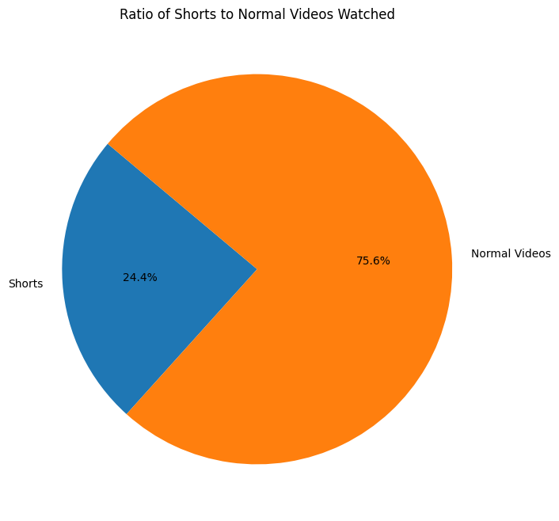
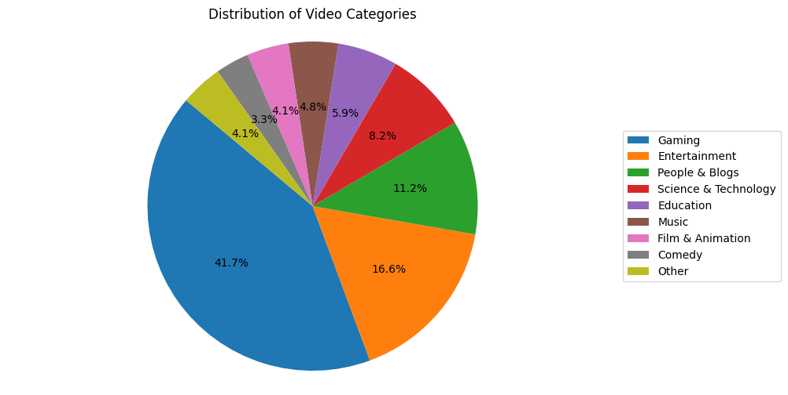
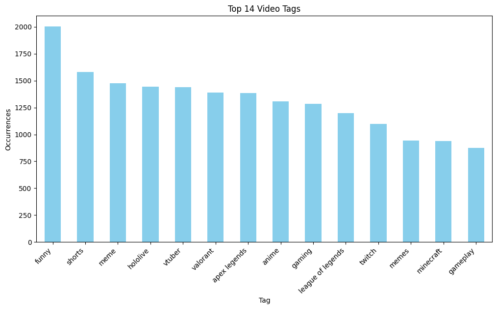
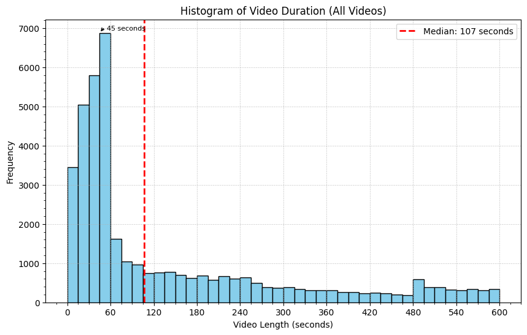
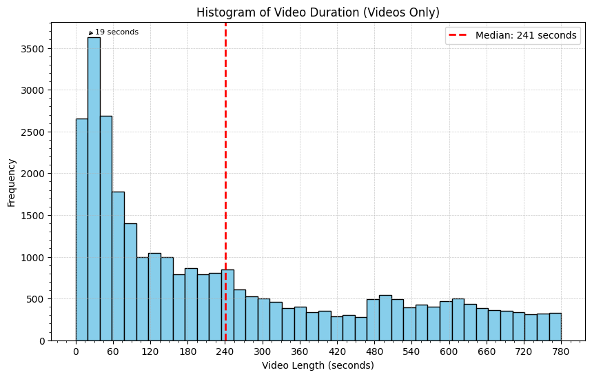
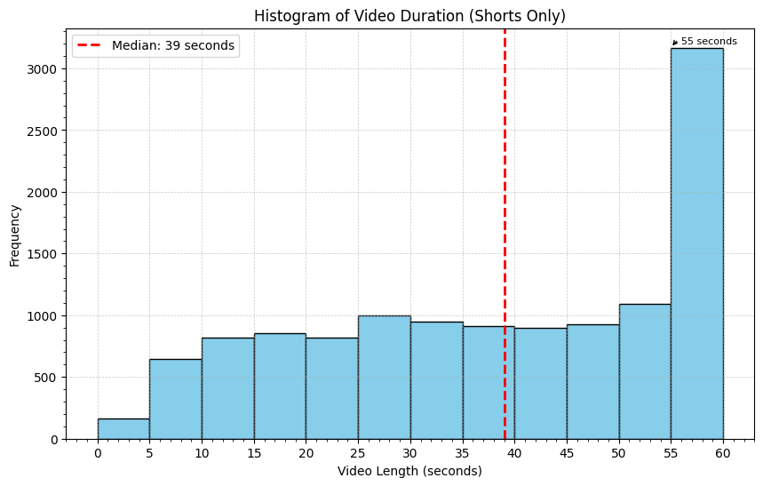
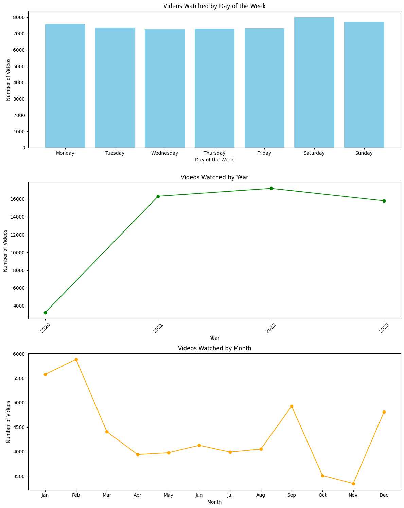
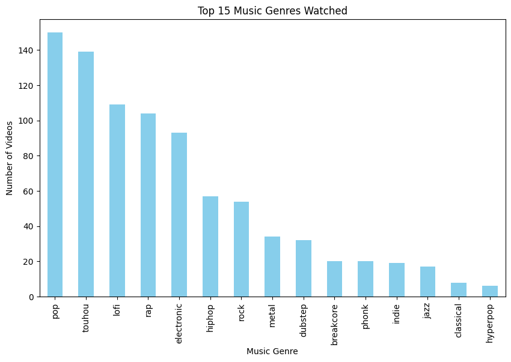
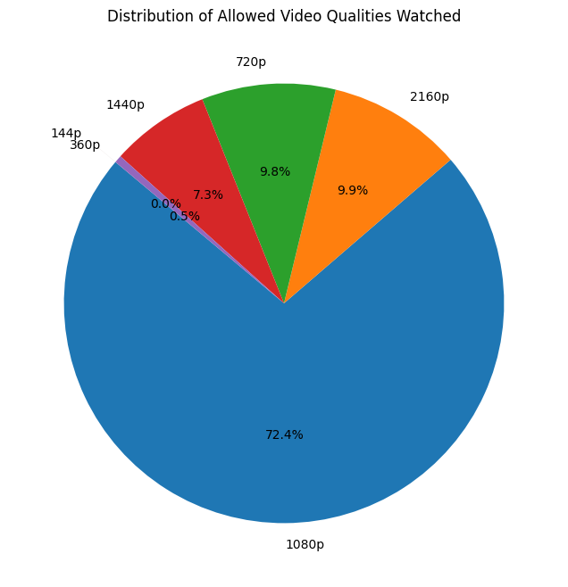

# Motivation:
I was curious about my watching habits, and since YouTube doesn't provice a service like this itself, I had to do it myself. YouTube Rewind exists, but that's not personal. What I did was like a 'YouTube 2020-2023 Recapped' Project. After gathering the data, I could ask questions to myself I was curious about and find ways to answer them. I wondered stuff like 'whose videos I watch the most?', or 'how much educational content do I watch by percentage?'.

# Data Source:
The beginning data for this project was taken from [Google Takeout](https://takeout.google.com/settings/takeout) 

However, it only contained an ugly .html file with only 5 colums! 
('video_link', 'channel_link', 'video_title', 'channel_name', 'watch_date_time')

BUT!!! The column 'video_link' was the strongest of them all, with that column and the power of web scraping, I added way more colums!

('subscribed', 'video_length', 'view_count', 'like_count', 'comment_count', 'description', 'description_length', 'category', 'tags', 'video_quality', 'is_shorts', 'publish_date')

By doing all this, I got a .csv file with 17 columns and 52K rows with lots of data points I could potentially analyze.


```python
import pandas as pd
import matplotlib.pyplot as plt
import seaborn as sns
import numpy as np
from matplotlib.ticker import MaxNLocator
import matplotlib.dates as mdates
import scipy.stats as stats
import re
import nltk
from nltk.corpus import stopwords
```


```python
# Load the CSV file into a DataFrame
csv_file_path = 'output2.csv'  # Replace with the actual path to your CSV file
df = pd.read_csv(csv_file_path)

# Drop YouTube shorts
#df.drop(df[df['is_shorts'] == True].index, inplace=True) #Optional toggle that changes everything that comes after this
```


```python
print(df.head(3))
```

                                        video_link  \
    0  https://www.youtube.com/watch?v=zlzzO1e6dws   
    1  https://www.youtube.com/watch?v=GUAQebYNzAQ   
    2  https://www.youtube.com/watch?v=GEDA4TmW44s   
    
                                            channel_link  \
    0  https://www.youtube.com/channel/UCRHZGz8g6b10r...   
    1  https://www.youtube.com/channel/UCausCHptqoa4o...   
    2  https://www.youtube.com/channel/UC4_SUDiYxC8xs...   
    
                                             video_title channel_name  \
    0   How to Download Your YouTube History! Downloa...   Scoby Tech   
    1                     I Got Vac Banned... Here's Why        Gomer   
    2                  Hydro Plant Surge Tank!!! #shorts    Fearjames   
    
              watch_date_time  subscribed video_length  view_count  like_count  \
    0  Dec 09, 2023, 19:03:02       False        02:08     21110.0    438000.0   
    1  Dec 09, 2023, 19:01:38       False        02:51      1429.0     28000.0   
    2  Dec 09, 2023, 17:57:36        True        00:38      1492.0    102000.0   
    
       comment_count                                        description  \
    0           47.0  Hey guys my name is Scoby and in todays video ...   
    1           30.0  I swear to Gaben if I don't get my skins back ...   
    2          530.0                                                NaN   
    
       description_length        category  \
    0                2770       Education   
    1                 107  People & Blogs   
    2                   0  People & Blogs   
    
                                                    tags video_quality  is_shorts  \
    0  ['scoby', 'youtube history', 'youtube history ...         1440p      False   
    1  ['counter strike 2', 'vac ban cs2', 'van ban',...         1080p      False   
    2                                                 []         1080p       True   
    
                 publish_date  
    0  Aug 22, 2018, 10:30:00  
    1  Dec 05, 2023, 11:51:45  
    2  Nov 05, 2023, 05:13:30  
    


```python
# Display DataFrame info
df.info()
```

    <class 'pandas.core.frame.DataFrame'>
    RangeIndex: 52552 entries, 0 to 52551
    Data columns (total 17 columns):
     #   Column              Non-Null Count  Dtype  
    ---  ------              --------------  -----  
     0   video_link          52552 non-null  object 
     1   channel_link        49947 non-null  object 
     2   video_title         52552 non-null  object 
     3   channel_name        49947 non-null  object 
     4   watch_date_time     52547 non-null  object 
     5   subscribed          52552 non-null  bool   
     6   video_length        49840 non-null  object 
     7   view_count          12871 non-null  float64
     8   like_count          49504 non-null  float64
     9   comment_count       6487 non-null   float64
     10  description         45412 non-null  object 
     11  description_length  52552 non-null  int64  
     12  category            49840 non-null  object 
     13  tags                52552 non-null  object 
     14  video_quality       48201 non-null  object 
     15  is_shorts           52552 non-null  bool   
     16  publish_date        49840 non-null  object 
    dtypes: bool(2), float64(3), int64(1), object(11)
    memory usage: 6.1+ MB
    


```python
# Group the data by channel_name and count the number of videos watched for each channel
channel_watch_count = df.groupby('channel_name')['video_title'].count().reset_index()

# Sort the channels by the number of videos watched in descending order
sorted_channels = channel_watch_count.sort_values(by='video_title', ascending=False)

# Select the top 10 channels
top_10_channels = sorted_channels.head(10)

# Display the result without the index column and with a more descriptive column name
print("Top 10 YouTubers based on the number of videos + shorts watched:")
top_10_channels = top_10_channels.rename(columns={'video_title': 'watched_videos'})
print(top_10_channels[['channel_name', 'watched_videos']].to_string(index=False))

```

    Top 10 YouTubers based on the number of videos + shorts watched:
               channel_name  watched_videos
              Mental Outlaw             445
        The Gaming Merchant             383
                  penguinz0             313
         SomeOrdinaryGamers             295
       Also Gaming Merchant             268
                Mok3ysnip3r             230
            Linus Tech Tips             225
     Daily Dose Of Internet             214
       SeeOk - Clash Royale             211
                   Hero Hei             210
    


```python
# Separate the data into two DataFrames based on is_shorts value
shorts_df = df[df['is_shorts'] == True]
not_shorts_df = df[df['is_shorts'] == False]

# Function to get top 10 YouTubers based on the number of videos watched
def get_top_youtubers(data):
    channel_watch_count = data.groupby('channel_name')['video_title'].count().reset_index()
    sorted_channels = channel_watch_count.sort_values(by='video_title', ascending=False)
    return sorted_channels.head(10)

# Get top 10 YouTubers for shorts and not shorts
top_10_shorts = get_top_youtubers(shorts_df)
top_10_not_shorts = get_top_youtubers(not_shorts_df)

# Display the results for normal videos without the index column and with a more descriptive column name
print("\nTop 10 YouTubers for normal videos:")
top_10_not_shorts = top_10_not_shorts.rename(columns={'video_title': 'watched_videos'})
print(top_10_not_shorts[['channel_name', 'watched_videos']].to_string(index=False))

# Display the results for shorts without the index column and with a more descriptive column name
print("\nTop 10 YouTubers for shorts:")
top_10_shorts = top_10_shorts.rename(columns={'video_title': 'watched_shorts'})
print(top_10_shorts[['channel_name', 'watched_shorts']].to_string(index=False))
```

    
    Top 10 YouTubers for normal videos:
             channel_name  watched_videos
            Mental Outlaw             444
                penguinz0             313
       SomeOrdinaryGamers             295
     Also Gaming Merchant             267
      The Gaming Merchant             254
              Mok3ysnip3r             230
     SeeOk - Clash Royale             211
                 Hero Hei             210
         Pants are Dragon             209
                     Grrt             206
    
    Top 10 YouTubers for shorts:
                      channel_name  watched_shorts
                          camman18             166
                 Action Lab Shorts             155
                            filian             138
                       Doug Sharpe             138
               The Gaming Merchant             129
                         mryeester             121
                          UFD Tech              89
                          JesseLHV              83
                            Vsauce              81
     Ugo Lord: Modern Age Attorney              76
    

**I knew [Mental Outlaw](https://www.youtube.com/channel/UC7YOGHUfC1Tb6E4pudI9STA) would show up as my favorite Youtuber before I even started the project.**

**My hypothesis about them being my favorite channel turned out to be correct.**


```python
# Count the number of shorts and normal videos
shorts_count = df[df['is_shorts'] == True]['video_link'].nunique()
normal_count = df[df['is_shorts'] == False]['video_link'].nunique()

# Create a pie chart
labels = ['Shorts', 'Normal Videos']
counts = [shorts_count, normal_count]

plt.figure(figsize=(8, 8))
plt.pie(counts, labels=labels, autopct='%1.1f%%', startangle=140)
plt.title('Ratio of Shorts to Normal Videos Watched')
plt.show()
```


    

    


**Graph looks like pacman lol**


```python
# Count the number of videos in each category
category_counts = df['category'].value_counts()

# Filter out small segments (e.g., less than 2%)
threshold = 0.02
small_segments = category_counts[category_counts / category_counts.sum() < threshold]
category_counts = category_counts[category_counts / category_counts.sum() >= threshold]
category_counts['Other'] = small_segments.sum()

# Display the main categories and their percentages
print("Main Categories:")
print(category_counts)

# Create a pie chart with improved label placement for the main categories
plt.figure(figsize=(10, 6))
plt.pie(category_counts, labels=None, autopct='%1.1f%%', startangle=140)

# Display category labels outside the pie chart with better positioning
plt.gca().legend(category_counts.index, loc='center left', bbox_to_anchor=(1, 0.5))
plt.title('Distribution of Video Categories')
plt.axis('equal')  # Equal aspect ratio ensures that the pie is drawn as a circle.

plt.show()

# Display the details of the 'Other' category
if 'Other' in category_counts.index:
    other_details = df[df['category'].isin(small_segments.index)]
    print("\nDetails of 'Other' category:")
    print(other_details[['category', 'video_title']])
else:
    print("\nNo 'Other' category present.")
```

    Main Categories:
    Gaming                  20808
    Entertainment            8276
    People & Blogs           5592
    Science & Technology     4064
    Education                2931
    Music                    2416
    Film & Animation         2050
    Comedy                   1639
    Other                    2064
    Name: category, dtype: int64
    


    

    


    
    Details of 'Other' category:
                  category                                        video_title
    3      Travel & Events            The Reason Warts Shouldn't Be Cut Off 🤔
    15      Pets & Animals                 Cat Wall Training #outdoorsavannah
    28     Travel & Events        Why American Eggs Have To be Refrigerated 😬
    47      Pets & Animals   russian tortoise drinking water | sulcata tor...
    58      Pets & Animals                          Demonstration of Spin 1/2
    ...                ...                                                ...
    52471    Howto & Style             Finding Out I'm Pregnant *AFTER 9 YRS*
    52474   Pets & Animals                                     watame factory
    52478  News & Politics                  Süt fabrikasında banyo skandalı!
    52479  News & Politics          Bu eve nasıl 'az hasarlı' raporu verilir?
    52489  News & Politics   Scientists discover bizarre hell planet where...
    
    [2064 rows x 2 columns]
    


```python
# Extract and flatten the video tags
all_tags = [tag for tags in df['tags'].dropna() for tag in eval(tags)]

# Create a DataFrame to count tag occurrences
tag_counts = pd.Series(all_tags).value_counts()

# Display the top N tags
top_n = 14
top_tags = tag_counts.head(top_n)

# Plot a bar chart
plt.figure(figsize=(12, 6))
top_tags.plot(kind='bar', color='skyblue')
plt.title(f'Top {top_n} Video Tags')
plt.xlabel('Tag')
plt.ylabel('Occurrences')
plt.xticks(rotation=45, ha='right')
plt.show()
```


    

    


```python
# Convert video length to total seconds
def convert_to_seconds(time_str):
    if pd.isna(time_str):
        return np.nan
    minutes, seconds = map(int, time_str.split(':'))
    return minutes * 60 + seconds

df['video_length_seconds'] = df['video_length'].apply(convert_to_seconds)

# Split the dataframe for all videos and for non-shorts videos
df_all_videos = df
df_shorts = df[df['is_shorts'] == True]
df_not_shorts = df[df['is_shorts'] == False]

# Function to create a histogram plot with toggle for mean or median
def create_histogram(dataframe, title, ax, bin_size, binmax, use_median=True):
    # Calculate central tendency based on the toggle
    if use_median:
        central_value = dataframe['video_length_seconds'].median()
        central_label = 'Median'
    else:
        central_value = dataframe['video_length_seconds'].mean()
        central_label = 'Mean'
    
    # Binning configuration
    bins_range = (0, binmax)

    # Plot histogram
    counts, bins, _ = ax.hist(dataframe['video_length_seconds'].dropna(), bins=bin_size, range=bins_range, color='skyblue', edgecolor='black')

    # Central tendency line
    ax.axvline(central_value, color='red', linestyle='dashed', linewidth=2, label=f'{central_label}: {int(central_value)} seconds')

    # Title and labels
    ax.set_title(title)
    ax.set_xlabel('Video Length (seconds)')
    ax.set_ylabel('Frequency')
    ax.legend()

    # Ticks and grid
    ax.xaxis.set_major_locator(MaxNLocator(integer=True))
    ax.grid(True, linestyle='--', linewidth=0.5, alpha=0.7)
    # Enable minor ticks on the x-axis
    plt.minorticks_on()

    # Annotation for the bin with the maximum count
    max_count_index = np.argmax(counts)
    max_bin_value = bins[max_count_index]
    ax.annotate(f'{int(max_bin_value)} seconds', xy=(max_bin_value, counts[max_count_index]),
                xytext=(8, 3), textcoords='offset points',
                arrowprops=dict(arrowstyle='->', connectionstyle='arc3,rad=.5'), fontsize=8)

# Add a toggle for median and mean
use_median_toggle = True  # Set to False to use mean instead of median | extreme outliers ruined the mean results, that's why I opted to use median.

# Create figure and a single set of axes
fig, axs = plt.subplots(figsize=(10, 6))

# Plot histograms
create_histogram(df_all_videos, 'Histogram of Video Duration (All Videos)', axs, 40, 600, use_median=use_median_toggle)

# Set x ticks every 60 seconds
plt.xticks(np.arange(0, 601, 60))

# Display the plot
plt.show()
```


    

    


```python
# Create figure and a single set of axes
fig, axs = plt.subplots(figsize=(10, 6))

# Call the function with a single set of axes
create_histogram(df_not_shorts, 'Histogram of Video Duration (Videos Only)', axs, 40, 780, use_median=use_median_toggle)

# Set x ticks every 60 seconds
plt.xticks(np.arange(0, 801, 60))

# Display the plot
plt.show()
```


    

    


```python
seed_value = 8  
shuffled_df_not_shorts_15_seconds = df_not_shorts[df_not_shorts['video_length_seconds'] == 15].sample(frac=1, random_state=seed_value)

# Display the first few rows of the shuffled DataFrame
print(shuffled_df_not_shorts_15_seconds.head())
```

                                            video_link  \
    49838  https://www.youtube.com/watch?v=bPgi39vBeGM   
    49011  https://www.youtube.com/watch?v=1PQ2LC5O3dE   
    49069  https://www.youtube.com/watch?v=17UOd-EqZPU   
    44072  https://www.youtube.com/watch?v=ull5YaEHvw0   
    755    https://www.youtube.com/watch?v=BJUbLM8coho   
    
                                                channel_link  \
    49838  https://www.youtube.com/channel/UCF5g30i--vn34...   
    49011  https://www.youtube.com/channel/UC9wxb6Q1-QqTb...   
    49069  https://www.youtube.com/channel/UCXXU8EZGvlw5x...   
    44072  https://www.youtube.com/channel/UCgypNw4RJdgOA...   
    755    https://www.youtube.com/channel/UCOG9EOz-VHx6I...   
    
                                                 video_title         channel_name  \
    49838   Mr Krabs Overdoses on ketamine speedrun Death...             ImJackTV   
    49011            [Touhou Parody Short] Okuu's Commercial    Holman Animations   
    49069                                               jett               cranos   
    44072                               Are you from Russia?               Raezra   
    755                Chainsaw Man Author Tries To Levitate   El Alumno de Atrás   
    
                  watch_date_time  subscribed video_length  view_count  \
    49838  Dec 21, 2020, 21:47:59       False        00:15         NaN   
    49011  Jan 05, 2021, 00:35:05       False        00:15         NaN   
    49069  Jan 04, 2021, 12:27:05        True        00:15         NaN   
    44072  Apr 06, 2021, 21:57:13       False        00:15         NaN   
    755    Oct 28, 2023, 01:12:47       False        00:15      5095.0   
    
           like_count  comment_count  \
    49838     16000.0            NaN   
    49011     63000.0            NaN   
    49069      2000.0            NaN   
    44072    458000.0            NaN   
    755      251000.0            NaN   
    
                                                 description  description_length  \
    49838                                   Sub to me please                  16   
    49011  「 DOUBLE SUN POWER ! !」\nOriginal Audio by 'Ol...                 174   
    49069  GPU: GeForce RTX 2080\nCPU: Intel(R) Core(TM) ...                 182   
    44072  This video is not mine it is from Anomaly's ch...                 239   
    755    Tatsuki Fujimoto is the mangaka of Chainsaw Ma...                 271   
    
                   category                                               tags  \
    49838     Entertainment  ['Gaming', 'Game', 'Mr Krabs Overdoses on keta...   
    49011  Film & Animation                                                 []   
    49069            Gaming  ['#GeForceGTX', '#ShotWithGeForce', '#valorant...   
    44072            Gaming    ['Anomaly', 'CS:GO', 'Russia', 'Anomaly CS:GO']   
    755       Entertainment                                                 []   
    
          video_quality  is_shorts            publish_date  video_length_seconds  
    49838         1080p      False  Dec 17, 2020, 12:35:34                  15.0  
    49011         1080p      False  Aug 28, 2017, 08:51:00                  15.0  
    49069         1440p      False  Jan 03, 2021, 08:27:25                  15.0  
    44072          720p      False  Mar 17, 2018, 14:04:20                  15.0  
    755           1080p      False  Dec 13, 2021, 14:46:59                  15.0  
    

**The abundance of videos around the 15 second mark for non-short videos concerned me, so I analyzed it manually, and it seems legit.**


```python
# Create figure and a single set of axes
fig, axs = plt.subplots(figsize=(10, 6))

# Call the function with a single set of axes
create_histogram(df_shorts, 'Histogram of Video Duration (Shorts Only)', axs, 12, 60, use_median=True)

# Set x ticks every 5 seconds (adjust as needed)
axs.set_xticks(np.arange(0, 61, 5))

# Enable minor ticks on the x-axis every 1 second (adjust as needed)
axs.xaxis.set_minor_locator(plt.MultipleLocator(1))

# Display the plot
plt.show()

# Calculate mode
video_lengths = df_shorts['video_length_seconds'].dropna()
mode_result = stats.mode(video_lengths, axis=None, keepdims=True)  # Explicitly set keepdims
mode_value = mode_result.mode[0]
mode_count = mode_result.count[0]

# Display mode information
print(f"Mode: {mode_value} seconds (Count: {mode_count})")

```


    

    


    Mode: 59.0 seconds (Count: 1413)
    

**As I expected, YouTube shorts tend to aim around the 60 second mark, but the existance of even shorter shorts brings down the"median to 39 seconds.**


```python
df['video_length_seconds'] = df['video_length'].apply(convert_to_seconds)

# Find the index of the video with the longest duration
max_length_index = df['video_length_seconds'].idxmax()
min_length_index = df['video_length_seconds'].idxmin()

# Get the row with the longest duration
longest_video = df.loc[max_length_index]
shortest_video = df.loc[min_length_index]

# Convert the duration of the longest video to days, hours, minutes, and seconds
duration_seconds = longest_video['video_length_seconds']
days, remainder = divmod(duration_seconds, 86400)
hours, remainder = divmod(remainder, 3600)
minutes, seconds = divmod(remainder, 60)

# Print information about the shortest video
print("Shortest Video:")
print(f"Video Title: {shortest_video['video_title']}")
print(f"Video Link: {shortest_video['video_link']}")
print(f"Video Length: {shortest_video['video_length']}")
print(f"Video Length (seconds): {shortest_video['video_length_seconds']} seconds")

# Print information about the longest video
print("\nLongest Video:")
print(f"Video Title: {longest_video['video_title']}")
print(f"Video Link: {longest_video['video_link']}")
print(f"Video Length: {longest_video['video_length']}")
print(f"Video Duration: {days} days, {hours} hours, {minutes} minutes, {seconds} seconds")
```

    Shortest Video:
    Video Title:  CHILIBEAN.mp4
    Video Link: https://www.youtube.com/watch?v=lLFHnkgfnes
    Video Length: 00:00
    Video Length (seconds): 0.0 seconds
    
    Longest Video:
    Video Title:  lofi hip hop radio - beats to relax/study to
    Video Link: https://www.youtube.com/watch?v=5qap5aO4i9A
    Video Length: 1250623:50
    Video Duration: 868.0 days, 11.0 hours, 43.0 minutes, 50.0 seconds
    

**Lo-fi hip hop radio livestreamed music 24/7 on this exact link for 2.37 years! That's so long that YouTube won't even let you watch it anymore...**


```python
# Convert 'publish_date' and 'watch_date_time' columns to datetime
df['publish_date'] = pd.to_datetime(df['publish_date'])
df['watch_date_time'] = pd.to_datetime(df['watch_date_time'])

# Sort DataFrame by 'publish_date' and 'watch_date_time' in ascending order
df_sorted_publish = df.sort_values(by='publish_date', ascending=True).reset_index(drop=True)
df_sorted_watch = df.sort_values(by='watch_date_time', ascending=True).reset_index(drop=True)

# Get the oldest video by publish date
oldest_by_publish = df_sorted_publish.iloc[0]

# Get the oldest video by watch time
oldest_by_watch = df_sorted_watch.iloc[0]

print("Oldest video by publish date:")
print(oldest_by_publish[['video_title', 'video_link', 'publish_date']])

print("\nOldest video by watch time:")
print(oldest_by_watch[['video_title', 'video_link', 'watch_date_time']])
```

    Oldest video by publish date:
    video_title                                   Me at the zoo
    video_link      https://www.youtube.com/watch?v=jNQXAC9IVRw
    publish_date                            2005-04-23 20:31:52
    Name: 0, dtype: object
    
    Oldest video by watch time:
    video_title                        ina 1000iq braincell moment
    video_link         https://www.youtube.com/watch?v=Xw56mDCf8hw
    watch_date_time                            2020-11-05 04:11:51
    Name: 0, dtype: object
    

**Of course the oldest video by publish date is "Me at the zoo", it's the oldest video on YouTube after all and I've seen it!**

**..and the oldest video by watch time is on the day I decided to turn on my YouTube watch history again, I don't know why I had it frozen and cleared, I regret that decision now, I could've had way more data, although 3-4 years of data is already huge and even that took me a while to crunch through, 8 hours of processing time in total, ran it on two processes so it took only 4, if I could implement multiprocessing it would have been way faster though.**


```python
# Convert 'watch_date_time' to a datetime object
df['watch_date_time'] = pd.to_datetime(df['watch_date_time'])

# Create new columns for day of the week, year, and month
df['day_of_week'] = df['watch_date_time'].dt.day_of_week
df['year'] = df['watch_date_time'].dt.year
df['month'] = df['watch_date_time'].dt.month

# Group by day of the week, year, and month and count the number of videos watched
videos_by_day_of_week = df.groupby('day_of_week').size()
videos_by_year = df.groupby('year').size()
videos_by_month = df.groupby('month').size()

# Plotting
fig, axs = plt.subplots(3, 1, figsize=(12, 15))

# Plot for videos watched by day of the week
axs[0].bar(videos_by_day_of_week.index, videos_by_day_of_week.values, color='skyblue')
axs[0].set_title('Videos Watched by Day of the Week')
axs[0].set_xlabel('Day of the Week')
axs[0].set_ylabel('Number of Videos')
axs[0].set_xticks(range(7))
axs[0].set_xticklabels(['Monday', 'Tuesday', 'Wednesday', 'Thursday', 'Friday', 'Saturday', 'Sunday'])

# Plot for videos watched by year
axs[1].plot(videos_by_year.index, videos_by_year.values, marker='o', linestyle='-', color='green')
axs[1].set_title('Videos Watched by Year')
axs[1].set_xlabel('Year')
axs[1].set_ylabel('Number of Videos')
axs[1].xaxis.set_major_locator(plt.MaxNLocator(integer=True))  # Show every year as an integer
axs[1].tick_params(axis='x', rotation=45)  # Rotate the year labels for better visibility

# Plot for videos watched by month
axs[2].plot(videos_by_month.index, videos_by_month.values, marker='o', linestyle='-', color='orange')
axs[2].set_title('Videos Watched by Month')
axs[2].set_xlabel('Month')
axs[2].set_ylabel('Number of Videos')

# Use month names as x-axis tick labels
month_names = ['Jan', 'Feb', 'Mar', 'Apr', 'May', 'Jun', 'Jul', 'Aug', 'Sep', 'Oct', 'Nov', 'Dec']
axs[2].set_xticks(range(1, 13))
axs[2].set_xticklabels(month_names)

plt.tight_layout()
plt.show()
```


    

    


**Videos watched being low in 2020 is due to me turning on my watch history amidst 2020 instead of at Jan 1.**
**Other than that, it's weird seeing how days of the week and years don't really matter, but for months it matters a lot.**
**My hypothesis for watch count being low in summer is that I play games/hang out with friends when I have lots of free time rather than trying to help my boredom in a school setting.**


```python
video_watch_counts = df['video_link'].value_counts()
top_11_watched_videos = video_watch_counts.head(11)
top_10_watched_videos = top_11_watched_videos.iloc[:10].drop(top_11_watched_videos.index[4])

print("Top 10 Most-Watched Videos:")
for rank, (video_link, watch_count) in enumerate(top_10_watched_videos.items(), start=1):
    video_name = df[df['video_link'] == video_link]['video_title'].iloc[0]
    print(f"{rank}. Video Link: {video_link}\t Video Title: {video_name}\t Watch Count: {watch_count}")
```

    Top 10 Most-Watched Videos:
    1. Video Link: https://www.youtube.com/watch?v=FtutLA63Cp8	 Video Title:  【東方】Bad Apple!! ＰＶ【影絵】	 Watch Count: 17
    2. Video Link: https://www.youtube.com/watch?v=JH23_kuLNMg	 Video Title:  SVRGE - Nocturnal	 Watch Count: 16
    3. Video Link: https://www.youtube.com/watch?v=UnIhRpIT7nc	 Video Title:  稲葉曇『ラグトレイン』Vo. 歌愛ユキ	 Watch Count: 16
    4. Video Link: https://www.youtube.com/watch?v=hsXeFqj5p7Q	 Video Title:  Defqwop - Heart Afire (ft. Strix)	 Watch Count: 16
    5. Video Link: https://www.youtube.com/watch?v=PvT8Kx1WC64	 Video Title:  GTA IV - Soviet Connection (New mixed Intro)	 Watch Count: 12
    6. Video Link: https://www.youtube.com/watch?v=lX44CAz-JhU	 Video Title:  SIAMÉS "The Wolf" [Official Animated Music Video]	 Watch Count: 11
    7. Video Link: https://www.youtube.com/watch?v=NMRhx71bGo4	 Video Title:  Let It Happen	 Watch Count: 10
    8. Video Link: https://www.youtube.com/watch?v=qi3o0c6-Q0o	 Video Title:  what.mp4	 Watch Count: 10
    9. Video Link: https://www.youtube.com/watch?v=32RJPfqxwFo	 Video Title:  Hololive Rhythm Heaven Remix 10	 Watch Count: 10
    

**It only makes sense that the videos I watched on repeat are music!**


```python
# Filter videos with the "music" tag
music_df = df[df['tags'].apply(lambda tags: 'music' in tags)].copy()

# Extract information about each tag as a potential genre
music_df['tags'] = music_df['tags'].apply(lambda tags: [re.sub(r'\W+', '', tag.lower()) for tag in tags.split()])

# List of common genre names
common_genres = ['rock', 'pop', 'hiphop', 'rap', 'jazz', 'classical', 'country', 'metal', 'electronic', 'indie', 'breakcore', 'dubstep','melodic death metal', 'hyperpop', 'phonk', 'touhou', 'lofi']
# DO NOT INCLUDE ANIME| IT TOWERS ANYTHING ELSE

# Filter tags based on common genre names
music_df['tags'] = music_df['tags'].apply(lambda tags: [tag for tag in tags if tag in common_genres])

# Flatten the list of tags for counting
all_tags = [tag for tags in music_df['tags'] for tag in tags]

# Convert the list to a Pandas Series
tag_series = pd.Series(all_tags)

# Count occurrences of each tag
tag_counts = tag_series.value_counts()

# Visualize the distribution of music tags (top 10)
top_tags = tag_counts.head(15)
plt.figure(figsize=(10, 6))
top_tags.plot(kind='bar', color='skyblue')
plt.title('Top 15 Music Genres Watched')
plt.xlabel('Music Genre')
plt.ylabel('Number of Videos')
plt.show()
```


    

    


**If you asked me in person I'd have just said 'electronic'...**

**Doing a 'pseudo-Spotify' analysis using YouTube was pretty cool.**


```python
# Convert 'watch_date_time' to a datetime object
df['watch_date_time'] = pd.to_datetime(df['watch_date_time'])

# Filter out shorts
non_shorts_df = df[df['is_shorts'] == False]

# Calculate the number of non-short videos watched per day
non_short_videos_per_day = non_shorts_df.groupby(non_shorts_df['watch_date_time'].dt.date)['video_link'].count()

# Find the day with the most non-short videos watched
most_watched_day = non_short_videos_per_day.idxmax()
most_watched_non_short_videos = non_shorts_df[non_shorts_df['watch_date_time'].dt.date == most_watched_day]

# Get the first and last watch date and time for the most-watched day
first_watch_time = most_watched_non_short_videos['watch_date_time'].min()
last_watch_time = most_watched_non_short_videos['watch_date_time'].max()

print("Day with the Most Non-Short Videos Watched:")
print(f"Date: {most_watched_day}")
print(f"Total Non-Short Videos Watched on that day: {non_short_videos_per_day[most_watched_day]}")
print(f"First Watch Time: {first_watch_time}")
print(f"Last Watch Time: {last_watch_time}")

# Calculate session length
session_length = last_watch_time - first_watch_time
print(f"Session Length: {session_length}")
```

    Day with the Most Non-Short Videos Watched:
    Date: 2021-01-08
    Total Non-Short Videos Watched on that day: 175
    First Watch Time: 2021-01-08 00:03:33
    Last Watch Time: 2021-01-08 23:58:02
    Session Length: 0 days 23:54:29
    

**I analyzed it manually as I couldn't believe it and turns out it's a mix of having watched lots of videos that day on top of leaving music on to play in the background, and it seems to count videos I watched after midnight on the day before too.**


```python
# Filter videos with the "funny" tag
funny_videos = df[df['tags'].apply(lambda x: isinstance(x, list) and 'funny' in map(str.lower, x))]

if not funny_videos.empty:
    # Find the video with the most likes among funny videos
    funniest_video = funny_videos.loc[funny_videos['like_count'].idxmax()]

    # Print information about the funniest video
    print("Funniest Video:")
    print("Video Title:", funniest_video['video_title'])
    print("Channel Name:", funniest_video['channel_name'])
    print("Likes:", funniest_video['like_count'])
    print("Video Link:", funniest_video['video_link'])
else:
    print("No videos with the 'funny' tag found.")


```

    No videos with the 'funny' tag found.
    


```python
# Filter out shorts
non_shorts_df = df[df['is_shorts'] == False]

# Define the allowed resolutions
allowed_resolutions = ['144p', '360p', '720p', '1080p', '1440p', '2160p']

# Filter out video qualities not in the allowed resolutions
filtered_df = non_shorts_df[non_shorts_df['video_quality'].isin(allowed_resolutions)]

# Count the occurrences of each video quality
video_quality_counts = filtered_df['video_quality'].value_counts()

# Create a list to explode specific slices
explode = [0.1 if resolution in ['144p'] else 0 for resolution in video_quality_counts.index]

# Create a pie chart
plt.figure(figsize=(8, 8))
plt.pie(video_quality_counts, labels=video_quality_counts.index, autopct='%1.1f%%', startangle=140, explode=explode)
plt.title('Distribution of Allowed Video Qualities Watched')
plt.show()
```


    

    


**There being more 4K videos than 2K videos in my watch history is interesting. I feel like my dataset is so big that I can come to general conclusion just from my own data**


```python
# Remove newline characters from the description
df['clean_description'] = df['description'].replace('\n', ' ', regex=True)

# Compute the length of the cleaned description
df['clean_description_length'] = df['clean_description'].str.len()

# Find the index of the video with the longest cleaned description
max_clean_desc_index = df['clean_description_length'].idxmax()

# Get the row with the longest cleaned description
video_with_longest_clean_desc = df.loc[max_clean_desc_index]

# Print information about the video with the longest cleaned description
print("Video with the Longest Cleaned Description:")
print(f"Video Link: {video_with_longest_clean_desc['video_link']}")
print(f"Cleaned Description Length: {video_with_longest_clean_desc['clean_description_length']} characters")
print(f"Cleaned Description:\n{video_with_longest_clean_desc['clean_description']}")
```

    Video with the Longest Cleaned Description:
    Video Link: https://www.youtube.com/watch?v=QQZ_k15sPag
    Cleaned Description Length: 9634.0 characters
    Cleaned Description:
       • I Can't Post Selfies Anymore...   he said he isnt there, heres proof he is\nobviously this is a scene from smiling friends, and its not muta ofc, just some character.\n\n\n\n\n\n\n\n\n\n\n\n\n\n\n\n\n\n\n\n\n\n\n\n\n\n\n\n\n\n\n\n\n\n\n\n\n\n\n\n\n\n\n\n\n\n\n\n\n\n\n\n\n\n\n\n\n\n\n\n\n\n\n\n\n\n\n\n\n\n\n\n\n\n\n\n\n\n\n\n\n\n\n\n\n\n\n\n\n\n\n\n\n\n\n\n\n\n\n\n\n\n\n\n\n\n\n\n\n\n\n\n\n\n\n\n\n\n\n\n\n\n\n\n\n\n\n\n\n\n\n\n\n\n\n\n\n\n\n\n\n\n\n\n\n\n\n\n\n\n\n\n\n\n\n\n\n\n\n\n\n\n\n\n\n\n\n\n\n\n\n\n\n\n\n\n\n\n\n\n\n\n\n\n\n\n\n\n\n\n\n\n\n\n\n\n\n\n\n\n\n\n\n\n\n\n\n\n\n\n\n\n\n\n\n\n\n\n\n\n\n\n\n\n\n\n\n\n\n\n\n\n\n\n\n\n\n\n\n\n\n\n\n\n\n\n\n\n\n\n\n\n\n\n\n\n\n\n\n\n\n\n\n\n\n\n\n\n\n\n\n\n\n\n\n\n\n\n\n\n\n\n\n\n\n\n\n\n\n\n\n\n\n\n\n\n\n\n\n\n\n\n\n\n\n\n\n\n\n\n\n\n\n\n\n\n\n\n\n\n\n\n\n\n\n\n\n\n\n\n\n\n\n\n\n\n\n\n\n\n\n\n\n\n\n\n\n\n\n\n\n\n\n\n\n\n\n\n\n\n\n\n\n\n\n\n\n\n\n\n\n\n\n\n\n\n\n\n\n\n\n\n\n\n\n\n\n\n\n\n\n\n\n\n\n\n\n\n\n\n\n\n\n\n\n\n\n\n\n\n\n\n\n\n\n\n\n\n\n\n\n\n\n\n\n\n\n\n\n\n\n\n\n\n\n\n\n\n\n\n\n\n\n\n\n\n\n\n\n\n\n\n\n\n\n\n\n\n\n\n\n\n\n\n\n\n\n\n\n\n\n\n\n\n\n\n\n\n\n\n\n\n\n\n\n\n\n\n\n\n\n\n\n\n\n\n\n\n\n\n\n\n\n\n\n\n\n\n\n\n\n\n\n\n\n\n\n\n\n\n\n\n\n\n\n\n\n\n\n\n\n\n\n\n\n\n\n\n\n\n\n\n\n\n\n\n\n\n\n\n\n\n\n\n\n\n\n\n\n\n\n\n\n\n\n\n\n\n\n\n\n\n\n\n\n\n\n\n\n\n\n\n\n\n\n\n\n\n\n\n\n\n\n\n\n\n\n\n\n\n\n\n\n\n\n\n\n\n\n\n\n\n\n\n\n\n\n\n\n\n\n\n\n\n\n\n\n\n\n\n\n\n\n\n\n\n\n\n\n\n\n\n\n\n\n\n\n\n\n\n\n\n\n\n\n\n\n\n\n\n\n\n\n\n\n\n\n\n\n\n\n\n\n\n\n\n\n\n\n\n\n\n\n\n\n\n\n\n\n\n\n\n\n\n\n\n\n\n\n\n\n\n\n\n\n\n\n\n\n\n\n\n\n\n\n\n\n\n\n\n\n\n\n\n\n\n\n\n\n\n\n\n\n\n\n\n\n\n\n\n\n\n\n\n\n\n\n\n\n\n\n\n\n\n\n\n\n\n\n\n\n\n\n\n\n\n\n\n\n\n\n\n\n\n\n\n\n\n\n\n\n\n\n\n\n\n\n\n\n\n\n\n\n\n\n\n\n\n\n\n\n\n\n\n\n\n\n\n\n\n\n\n\n\n\n\n\n\n\n\n\n\n\n\n\n\n\n\n\n\n\n\n\n\n\n\n\n\n\n\n\n\n\n\n\n\n\n\n\n\n\n\n\n\n\n\n\n\n\n\n\n\n\n\n\n\n\n\n\n\n\n\n\n\n\n\n\n\n\n\n\n\n\n\n\n\n\n\n\n\n\n\n\n\n\n\n\n\n\n\n\n\n\n\n\n\n\n\n\n\n\n\n\n\n\n\n\n\n\n\n\n\n\n\n\n\n\n\n\n\n\n\n\n\n\n\n\n\n\n\n\n\n\n\n\n\n\n\n\n\n\n\n\n\n\n\n\n\n\n\n\n\n\n\n\n\n\n\n\n\n\n\n\n\n\n\n\n\n\n\n\n\n\n\n\n\n\n\n\n\n\n\n\n\n\n\n\n\n\n\n\n\n\n\n\n\n\n\n\n\n\n\n\n\n\n\n\n\n\n\n\n\n\n\n\n\n\n\n\n\n\n\n\n\n\n\n\n\n\n\n\n\n\n\n\n\n\n\n\n\n\n\n\n\n\n\n\n\n\n\n\n\n\n\n\n\n\n\n\n\n\n\n\n\n\n\n\n\n\n\n\n\n\n\n\n\n\n\n\n\n\n\n\n\n\n\n\n\n\n\n\n\n\n\n\n\n\n\n\n\n\n\n\n\n\n\n\n\n\n\n\n\n\n\n\n\n\n\n\n\n\n\n\n\n\n\n\n\n\n\n\n\n\n\n\n\n\n\n\n\n\n\n\n\n\n\n\n\n\n\n\n\n\n\n\n\n\n\n\n\n\n\n\n\n\n\n\n\n\n\n\n\n\n\n\n\n\n\n\n\n\n\n\n\n\n\n\n\n\n\n\n\n\n\n\n\n\n\n\n\n\n\n\n\n\n\n\n\n\n\n\n\n\n\n\n\n\n\n\n\n\n\n\n\n\n\n\n\n\n\n\n\n\n\n\n\n\n\n\n\n\n\n\n\n\n\n\n\n\n\n\n\n\n\n\n\n\n\n\n\n\n\n\n\n\n\n\n\n\n\n\n\n\n\n\n\n\n\n\n\n\n\n\n\n\n\n\n\n\n\n\n\n\n\n\n\n\n\n\n\n\n\n\n\n\n\n\n\n\n\n\n\n\n\n\n\n\n\n\n\n\n\n\n\n\n\n\n\n\n\n\n\n\n\n\n\n\n\n\n\n\n\n\n\n\n\n\n\n\n\n\n\n\n\n\n\n\n\n\n\n\n\n\n\n\n\n\n\n\n\n\n\n\n\n\n\n\n\n\n\n\n\n\n\n\n\n\n\n\n\n\n\n\n\n\n\n\n\n\n\n\n\n\n\n\n\n\n\n\n\n\n\n\n\n\n\n\n\n\n\n\n\n\n\n\n\n\n\n\n\n\n\n\n\n\n\n\n\n\n\n\n\n\n\n\n\n\n\n\n\n\n\n\n\n\n\n\n\n\n\n\n\n\n\n\n\n\n\n\n\n\n\n\n\n\n\n\n\n\n\n\n\n\n\n\n\n\n\n\n\n\n\n\n\n\n\n\n\n\n\n\n\n\n\n\n\n\n\n\n\n\n\n\n\n\n\n\n\n\n\n\n\n\n\n\n\n\n\n\n\n\n\n\n\n\n\n\n\n\n\n\n\n\n\n\n\n\n\n\n\n\n\n\n\n\n\n\n\n\n\n\n\n\n\n\n\n\n\n\n\n\n\n\n\n\n\n\n\n\n\n\n\n\n\n\n\n\n\n\n\n\n\n\n\n\n\n\n\n\n\n\n\n\n\n\n\n\n\n\n\n\n\n\n\n\n\n\n\n\n\n\n\n\n\n\n\n\n\n\n\n\n\n\n\n\n\n\n\n\n\n\n\n\n\n\n\n\n\n\n\n\n\n\n\n\n\n\n\n\n\n\n\n\n\n\n\n\n\n\n\n\n\n\n\n\n\n\n\n\n\n\n\n\n\n\n\n\n\n\n\n\n\n\n\n\n\n\n\n\n\n\n\n\n\n\n\n\n\n\n\n\n\n\n\n\n\n\n\n\n\n\n\n\n\n\n\n\n\n\n\n\n\n\n\n\n\n\n\n\n\n\n\n\n\n\n\n\n\n\n\n\n\n\n\n\n\n\n\n\n\n\n\n\n\n\n\n\n\n\n\n\n\n\n\n\n\n\n\n\n\n\n\n\n\n\n\n\n\n\n\n\n\n\n\n\n\n\n\n\n\n\n\n\n\n\n\n\n\n\n\n\n\n\n\n\n\n\n\n\n\n\n\n\n\n\n\n\n\n\n\n\n\n\n\n\n\n\n\n\n\n\n\n\n\n\n\n\n\n\n\n\n\n\n\n\n\n\n\n\n\n\n\n\n\n\n\n\n\n\n\n\n\n\n\n\n\n\n\n\n\n\n\n\n\n\n\n\n\n\n\n\n\n\n\n\n\n\n\n\n\n\n\n\n\n\n\n\n\n\n\n\n\n\n\n\n\n\n\n\n\n\n\n\n\n\n\n\n\n\n\n\n\n\n\n\n\n\n\n\n\n\n\n\n\n\n\n\n\n\n\n\n\n\n\n\n\n\n\n\n\n\n\n\n\n\n\n\n\n\n\n\n\n\n\n\n\n\n\n\n\n\n\n\n\n\n\n\n\n\n\n\n\n\n\n\n\n\n\n\n\n\n\n\n\n\n\n\n\n\n\n\n\n\n\n\n\n\n\n\n\n\n\n\n\n\n\n\n\n\n\n\n\n\n\n\n\n\n\n\n\n\n\n\n\n\n\n\n\n\n\n\n\n\n\n\n\n\n\n\n\n\n\n\n\n\n\n\n\n\n\n\n\n\n\n\n\n\n\n\n\n\n\n\n\n\n\n\n\n\n\n\n\n\n\n\n\n\n\n\n\n\n\n\n\n\n\n\n\n\n\n\n\n\n\n\n\n\n\n\n\n\n\n\n\n\n\n\n\n\n\n\n\n\n\n\n\n\n\n\n\n\n\n\n\n\n\n\n\n\n\n\n\n\n\n\n\n\n\n\n\n\n\n\n\n\n\n\n\n\n\n\n\n\n\n\n\n\n\n\n\n\n\n\n\n\n\n\n\n\n\n\n\n\n\n\n\n\n\n\n\n\n\n\n\n\n\n\n\n\n\n\n\n\n\n\n\n\n\n\n\n\n\n\n\n\n\n\n\n\n\n\n\n\n\n\n\n\n\n\n\n\n\n\n\n\n\n\n\n\n\n\n\n\n\n\n\n\n\n\n\n\n\n\n\n\n\n\n\n\n\n\n\n\n\n\n\n\n\n\n\n\n\n\n\n\n\n\n\n\n\n\n\n\n\n\n\n\n\n\n\n\n\n\n\n\n\n\n\n\n\n\n\n\n\n\n\n\n\n\n\n\n\n\n\n\n\n\n\n\n\n\n\n\n\n\n\n\n\n\n\n\n\n\n\n\n\n\n\n\n\n\n\n\n\n\n\n\n\n\n\n\n\n\n\n\n\n\n\n\n\n\n\n\n\n\n\n\n\n\n\n\n\n\n\n\n\n\n\n\n\n\n\n\n\n\n\n\n\n\n\n\n\n\n\n\n\n\n\n\n\n\n\n\n\n\n\n\n\n\n\n\n\n\n\n\n\n\n\n\n\n\n\n\n\n\n\n\n\n\n\n\n\n\n\n\n\n\n\n\n\n\n\n\n\n\n\n\n\n\n\n\n\n\n\n\n\n\n\n\n\n\n\n\n\n\n\n\n\n\n\n\n\n\n\n\n\n\n\n\n\n\n\n\n\n\n\n\n\n\n\n\n\n\n\n\n\n\n\n\n\n\n\n\n\n\n\n\n\n\n\n\n\n\n\n\n\n\n\n\n\n\n\n\n\n\n\n\n\n\n\n\n\n\n\n\n\n\n\n\n\n\n\n\n\n\n\n\n\n\n\n\n\n\n\n\n\n\n\n\n\n\n\n\n\n\n\n\n\n\n\n\n\n\n\n\n\n\n\n\n\n\n\n\n\n\n\n\n\n\n\n\n\n\n\n\n\n\n\n\n\n\n\n\n\n\n\n\n\n\n\n\n\n\n\n\n\n\n\n\n\n\n\n\n\n\n\n\n\n\n\n\n\n\n\n\n\n\n\n\n\n\n\n\n\n\n\n\n\n\n\n\n\n\n\n\n\n\n\n\n\n\n\n\n\n\n\n\n\n\n\n\n\n\n\n\n\n\n\n\n\n\n\n\n\n\n\n\n\n\n\n\n\n\n\n\n\n\n\n\n\n\n\n\n\n\n\n\n\n\n\n\n\n\n\n\n\n\n\n\n\n\n\n\n\n\n\n\n\n\n\n\n\n\n\n\n\n\n\n\n\n\n\n\n\n\n\n\n\n\n\n\n\n\n\n\n\n\n\n\n\n\n\n\n\n\n\n\n\n\n\n\n\n\n\n\n\n\n\n\n\n\n\n\n\n\n\n\n\n\n\n\n\n\n\n\n\n\n\n\n\n\n\n\n\n\n\n\n\n\n\n\n\n\n\n\n\n\n\n\n\n\n\n\n\n\n\n\n\n\n\n\n\n\n\n\n\n\n\n\n\n\n\n\n\n\n\n\n\n\n\n\n\n\n\n\n\n\n\n\n\n\n\n\n\n\n\n\n\n\n\n\n\n\n\n\n\n\n\n\n\n\n\n\n\n\n\n\n\n\n\n\n\n\n\n\n\n\n\n\n\n\n\n\n\n\n\n\n\n\n\n\n\n\n\n\n\n\n\n\n\n\n\n\n\n\n\n\n\n\n\n\n\n\n\n\n\n\n\n\n\n\n\n\n\n\n\n\n\n\n\n\n\n\n\n\n\n\n\n\n\n\n\n\n\n\n\n\n\n\n\n\n\n\n\n\n\n\n\n\n\n\n\n\n\n\n\n\n\n\n\n\n\n\n\n\n\n\n\n\n\n\n\n\n\n\n\n\n\n\n\n\n\n\n\n\n\n\n\n\n\n\n\n\n\n\n\n\n\n\n\n\n\n\n\n\n\n\n\n\n\n\n\n\n\n\n\n\n\n\n\n\n\n\n\n\n\n\n\n\n\n\n\n\n\n\n\n\n\n\n\n\n\n\n\n\n\n\n\n\n\n\n\n\n\n\n\n\n\n\n\n\n\n\n\n\n\n\n\n\n\n\n\n\n\n\n\n\n\n\n\n\n\n\n\n\n\n\n\n\n\n\n\n\n\n\n\n\n\n\n\n\n\n\n\n\n\n\n\n\n\n\n\n\n\n\n\n\n\n\n\n\n\n\n\n\n\n\n\n\n\n\n\n\n\n\n\n\n\n\n\n\n\n\n\n\n\n\n\n\n\n\n\n\n\n\n\n\n\n\n\n\n\n\n\n\n\n\n\n\n\n\n\n\n\n\n\n\n\n\n\n\n\n\n\n\n\n\n\n\n\n\n\n\n\n\n\n\n\n\n\n\n\n\n\n\n\n\n\n\n\n\n\n\n\n\n\n\n\n\n\n\n\n\n\n\n\n\n\n\n\n\n\n\n\n\n\n\n\n\n\n\n\n\n\n\n\n\n\n\n\n\n\n\n\n\n\n\n\n\n\n\n\n\n\n\n\n\n\n\n\n\n\n\n\n\n\n\n\n\n\n\n\n\n\n\n\n\n\n\n\n\n\n\n\n\n\n\n\n\n\n\n\n\n\n\n\n\n\n\n\n\n\n\n\n\n\n\n\n\n\n\n\n\n\n\n\n\n\n\n\n\n\n\n\n\n\n\n\n\n\n\n\n\n\n\n\n\n\n\n\n\n\n\n\n\n\n\n\n\n\n\n\n\n\n\n\n\n\n\n\n\n\n\n\n\n\n\n\n\n\n\n\n\n\n\n\n\n\n\n\n\n\n\n\n\n\n\n\n\n\n\n\n\n\n\n\n\n\n\n\n\n\n\n\n\n\n\n\n\n\n\n\n\n\n\n\n\n\n\n\n\n\n\n\n\n\n\n\n\n\n\n\n\n\n\n\n\n\n\n\n\n\n\n\n\n\n\n\n\n\n\n\n\n\n\n\n\n\n\n\n\n\n\n\n\n\n\n\n\n\n\n\n\n\n\n\n\n\n\n\n\n\n\n\n\n\n\n\n\n\n\n\n\n\n\n\n\n\n\n\n\n\n\n\n\n\n\n\n\n\n\n\n\n\n\n\n\n\n\n\n\n\n\n\n\n\n\n\n\n\n\n\n\n\n\n\n\n\n\n\n\n\n\n\n\n\n\n\n\n\n\n\n\n\n\n\n\n\n\n\n\n\n\n\n\n\n\n\n\n\n\n\n\n\n\n\n\n\n\n\n\n\n\n\n\n\n\n\n\n\n\n\n\n\n\n\n\n\n\n\n\n\n\n\n\n\n\n\n\n\n\n\n\n\n\n\n\n\n\n\n\n\n\n\n\n\n\n\n\n\n\n\n\n\n\n\n\n\n\n\n\n\n\n\n\n\n\n\n\n\n\n\n\n\n\n\n\n\n\n\n\n\n\n\n\n\n\n\n\n\n\n\n\n\n\n\n\n\n\n\n\n\n\n\n\n\n\n\n\n\n\n\n\n\n\n\n\n\n\n\n\n\n\n\n\n\n\n\n\n\n\n\n\n\n\n\n\n\n\n\n\n\n\n\n\n\n\n\n\n\n\n\n\n\n\n\n\n\n\n\n\n\n\n\n\n\n\n\n\n\n\n\n\n\n\n\n\n\n\n\n\n\n\n\n\n\n\n\n\n\n\n\n\n\n\n\n\n\n\n\n\n\n\n\n\n\n\n\n\n\n\n\n\n\n\n\n\n\n\n\n\n\n\n\n\n\n\n\n\n\n\n\n\n\n\n\n\n\n\n\n\n\n\n\n\n\n\n\n\n\n\n\n\n\n\n\n\n\n\n\n\n\n\n\n\n\n\n\n\n\n\n\n\n\n\n\n\n\n\n\n\n\n\n\n\n\n\n\n\n\n\n\n\n\n\n\n\n\n\n\n\n\n\n\n\n\n\n\n\n\n\n\n\n\n\n\n\n\n\n\n\n\n\n\n\n\n\n\n\n\n\n\n\n\n\n\n\n\n\n\n\n\n\n\n\n\n\n\n\n\n\n\n\n\n\n\n\n\n\n\n\n\n\n\n\n\n\n\n\n\n\n\n\n\n\n\n\n\n\n\n\n\n\n\n\n\n\n\n\n\n\n\n\n\n\n\n\n\n\n\n\n\n\n\n\n\n\n\n\n\n\n\n\n\n\n\n\n\n\n\n\n\n\n\n\n\n\n\n\n\n\n\n\n\n\n\n\n\n\n\n\n\n\n\n\n\n\n\n\n\n\n\n\n\n\n\n\n\n\n\n\n\n\n\n\n\n\n\n\n\n\n\n\n\n\n\n\n\n\n\n\n\n\n\n\n\n\n\n\n\n\n\n\n\n\n\n\n\n\n\n\n\n\n\n\n\n\n\n\n\n\n\n\n\n\n\n\n\n\n\n\n\n\n\n\n\n\n\n\n\n\n\n\n\n\n\n\n\n\n\n\n\n\n\n\n\n\n\n\n\n\n\n\n\n\n\n\n\n\n\n\n\n\n\n\n\n\n\n\n\n\n\n\n\n\n\n\n\n\n\n\n\n\n\n\n\n\n\n\n\n\n\n\n\n\n\n\n\n\n\n\n\n\n\n\n\n\n\n\n\n\n\n\n\n\n\n\n\n\n\n\n\n\n\n\n\n\n\n\n\n\n\n\n\n\n\n\n\n\n\n\n\n\n\n\n\n\n\n\n\n\n\n\n\n\n\n\n\n\n\n\n\n\n\n\n\n\n\n\n\n\n\n\n\n\n\n\n\n\n\n\n\n\n\n\n\n\n\n\n\n\n\n\n\n\n\n\n\n\n\n\n\n\n\n\n\n\n\n\n\n\n\n\n\n\n\n\n\n\n\n\n\n\n\n\n\n\n\n\n\n\n\n\n\n\n\n\n\n\n\n\n\n\n\n\n\n\n\n\n\n\n\n\n\n\n\n\n\n\n\n\n\n\n\n\n\n\n\n\n\n\n\n\n\n\n\n\n\n\n\n\n\n\n\n\n\n\n\n\n\n\n\n\n\n\n\n\n\n\n\n\n\n\n\n\n\n\n\n\n\n\n\n\n\n\n\n\n\n\n\n\n\n\n\n\n\n\n\n\n\n\n\n\n\n\n\n\n\n\n\n\n\n\n\n\n\n\n\n\n\n\n\n\n\n\n\n\n\n\n\n\n\n\n\n\n\n\n\n\n\n\n\n\n\n\n\n\n\n\n\n\n\n\n\n\n\n\n\n\n\n\n\n\n\n\n\n\n\n\n\n\n\n\n\n\n\n\n\n\n\n\n\n\n\n\n\n\n\n\n\n\n\n\n\n\n\n\n\n\n\n\n\n\n\n\n\n\n\n\n\n\n\n\n\n\n\n\n\n\n\n\n\n\n\n\n\n\n\n\n\n\n\n\n\n\n\n\n\n\n\n\n\n\n\n\n\n\n\n\n\n\n\n\n\n\n\n\n\n\n\n\n\n\n\n\n\n\n\n\n\n\n\n\n\n\n\n\n\n\n\n\n\n\n\n\n\n\n\n\n\n\n\n\n\n\n\n\n\n\n\n\n\n\n\n\n\n\n\n\n\n\n\n\n\n\n\n\n\n\n\n\n\n\n\n\n\n\n\n\n\n\n\n\n\n\n\n\n\n\n\n\n\n\n\n\n\n\n\n   • You found moonzeri!!  
    

**That is actually the LONGEST description, you can click on the video and see how long it is!**

# Findings:
Turns out, I don't watch as much educational content as I thought I did. I honestly expected to see more of it as that's what I've been interested in lately, but 3 years of entertainment content squashed those results.

I've obtained great insights about my viewing habits, maybe even learned a life-changing lesson or two about how now I feel bad about the type of content I watch and how I should transition towards more useful and educative content for the better. Also the amount is insane too..

Anothing finding for me was that... All of this was very fun! Since I was analyzing my own data, my curiosity about my own self gave me lots of inner motivation to dig down deeper and explore more. Every part of the process was fun (except waiting 4 + 4 = 4 hours for my data to be processed and pulling an all nighter to finish the project in a day), since I'm working with YouTube videos I've watched, some parts were nostalgic, and I dug out hidden gems and funny videos time and time again.

# Limitations and future work: 
The way I scraped like, view and comment counts seemed to return valid results so I didn't notice them being kind of broken, the data for them in some columns are correct while some are straight up wrong, that's why I decided to avoid doing any analysis regarding those. I'd fix them and do all of this again but it takes 8 hours to process 52000 videos by sending requests and webscraping the response and I only have 4 hours to submit this.

Webscraping is really limited and hard to do on a complex site like YouTube, some of my functions occasionally return false results or are unable to return results as YouTube's page source is really complicated, variable and big. Maybe if I could have used YouTube's API as they let you do 10k requests for free, but I didn't have enough time to spread that over 6+ days.
My scripts will stop working when YouTube gets updated too, I should've used BeautifulSoup a little bit better and MAYBE used Selenium, although it would be much slower, at least it would be much more consistent and correct.

Data was not a limitation in my project, I have 52 THOUSAND videos spread across 3-4 years, my data still has lots of untouched potential and I could analyze it further in the future.

But one problem was that the watch history YouTube provides isn't really a watch history, it's more like a 'history of videos you clicked on and stayed at least 3 seconds looked at it list'. If YouTube takeout provided 'where I left off' on a video, I'd be able to do a lot with it, like calculate how much actual time I spent watching stuff.
